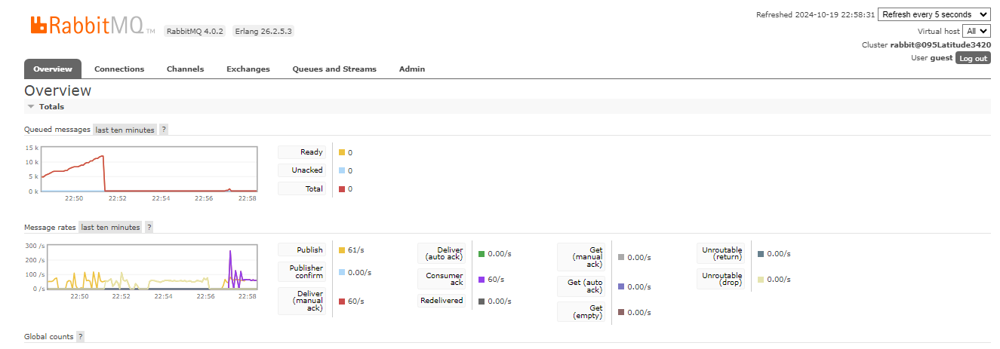
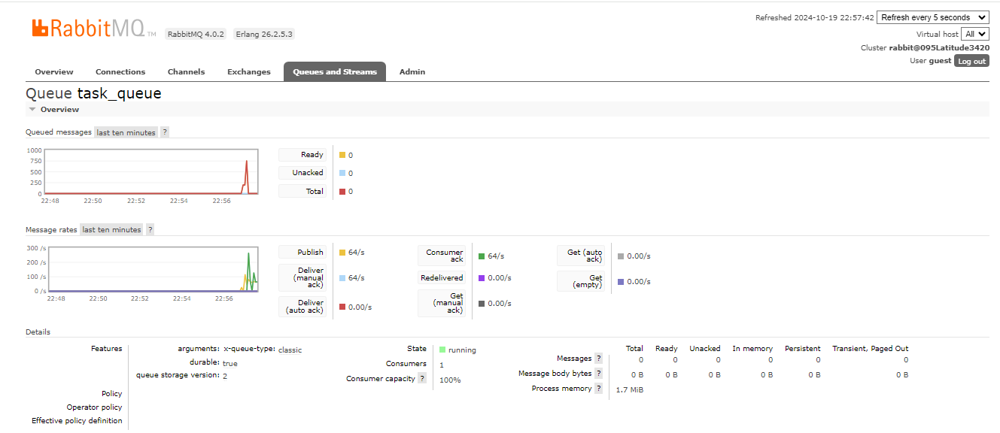

# Message-Queue-Asynchronous_messaging
## Overview

This project demonstrates a simple producer-consumer architecture using RabbitMQ for message queuing. The producer generates a large number of messages and sends them to a RabbitMQ queue, while the consumer asynchronously consumes and processes those messages. The system uses Python libraries such as `pika` and `aio_pika` to facilitate message publishing and consumption in a synchronous and asynchronous manner, respectively.

### Components:
1. **Producer**: The producer creates and sends messages to a queue in RabbitMQ using the `pika` library.
2. **Consumer**: The consumer receives and processes messages asynchronously using the `aio_pika` library.

---

## 1. Producer

The producer is responsible for generating a large number of messages (in this case, 1,000,000) and sending them to a specific queue (`task_queue`). It does so in a synchronous manner but runs within an asynchronous environment to allow for controlled, efficient execution.

### Key Points:
- The **`send_message`** function publishes individual messages to the RabbitMQ server.
- The **`send_messages`** function is an asynchronous loop that sends 1,000,000 messages to the queue. It prints a progress message every 10,000 messages sent.
- Messages are marked as **persistent** by setting the `delivery_mode=2` to ensure they are stored to disk, which provides durability in case of broker failures.
- The **pika** library is used to establish the connection and handle the message publishing.


---

## 2. Consumer

The consumer listens to the same `task_queue` and processes messages asynchronously. The use of asynchronous programming allows it to handle potentially large volumes of messages without blocking the event loop.

### Key Points:
- The **`process_message`** function is the message handler, which processes the message body and simulates message processing.
- The **`consume_messages`** function sets up the connection and starts consuming messages from RabbitMQ using `aio_pika`, which is an asynchronous alternative to `pika`.
- The consumer runs indefinitely until manually stopped (e.g., using `CTRL+C`).
- It is designed to handle messages one by one, and **`message.process()`** ensures proper message acknowledgment to RabbitMQ.

---

## RabbitMQ Setup

- **Queue**: A queue named `task_queue` is used for storing and delivering messages. It is declared as **durable**, meaning that the queue survives broker restarts.
- **Message Delivery**: Messages are delivered using the default exchange with a routing key that points to the `task_queue`.
- **Durability**: Both the queue and the messages are configured to be persistent to ensure data durability.



---

## Message Flow

1. **Producer Side**:
   - The producer generates a million messages and sends them to the `task_queue` in RabbitMQ.
   - Each message is marked as persistent, meaning it will not be lost if the broker crashes.


2. **Queue**:
   - RabbitMQ manages the `task_queue`, ensuring that messages are stored until they are consumed.
   - If there are no consumers active, the messages remain in the queue, waiting to be processed.

3. **Consumer Side**:
   - The consumer connects to the RabbitMQ queue asynchronously and processes messages as they arrive.
   - Each message is acknowledged after it has been processed to ensure it is not delivered again.

---


## Prerequisites

1. **Python 3.x**: The project is written in Python 3.
2. **RabbitMQ**: Ensure that RabbitMQ is installed and running locally on `localhost:5672`.
   - You can install RabbitMQ on most platforms or use a Docker container to run it.
3. **Pika Library**: Used for synchronous message publishing.
   - Install using: `pip install pika`
4. **Aio-pika Library**: Used for asynchronous message consumption.
   - Install using: `pip install aio-pika`

---

## Running the Project

1. **Start RabbitMQ**:
   - Ensure RabbitMQ is running on your local machine (`localhost:5672`) or another accessible server.
   - Use the RabbitMQ management interface (default at `http://localhost:15672`) to monitor the queue.

2. **Run the Producer**:
   - The producer script will generate and send 1,000,000 messages to the `task_queue` in RabbitMQ.
   - Execute the producer using:
     ```bash
     python producer.py
     ```

3. **Run the Consumer**:
   - The consumer script listens to the `task_queue` and processes the messages asynchronously.
   - Execute the consumer using:
     ```bash
     python consumer.py
     ```

---

## Monitoring

RabbitMQ provides a web-based management interface where you can monitor the queues, exchanges, connections, and consumers. By default, it is available at `http://localhost:15672`, and you can log in with the default credentials (`guest`/`guest`).

Key metrics to monitor:
- **Queued Messages**: Check the number of messages in the queue (ready, unacked).
- **Consumers**: See active consumers for the `task_queue`.
- **Message Rates**: View the rate at which messages are being published and consumed.



---

## Conclusion

This project demonstrates a simple yet scalable RabbitMQ setup using Python. The producer can send a high volume of messages, while the consumer handles them asynchronously, making this a great starting point for building robust distributed systems with message queuing.

